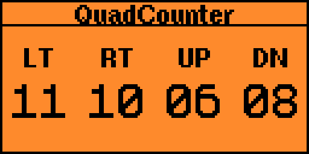

# QuadCount Deluxe

This is a simple external application for the [Flipper Zero](https://www.flipperzero.one), modified from the [VS Counter](https://github.com/JadePossible/Flipper-Versus-Counter) version. The app provides access to up to 4 counters, which can be used to track scores for tabletop games, for example.

## How to Use?

- The arrow buttons are for adding one to the score.
- The BACK key allows you to exit the app.

## Features

- **Multiple Counters**: app supports 4 counters.
- **Vibration Notification**: app includes a vibration for user feedback.

## Installation

You can either compile it yourself or install the `.fap` from the `dist` folder.
